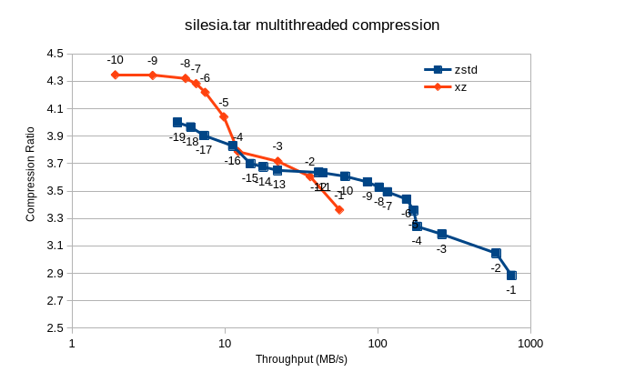

zstd vs xz, multithreaded (-T0)
===============================

Looks like zstd is *not* the silver bullet for all cases:

Tested with the silesia corpus from https://sun.aei.polsl.pl//~sdeor/index.php?page=silesia ,
decompressed and tar'ed into silesia.tar.

CPU = Intel(R) Core(TM) i5-3470 CPU @ 3.20GHz
